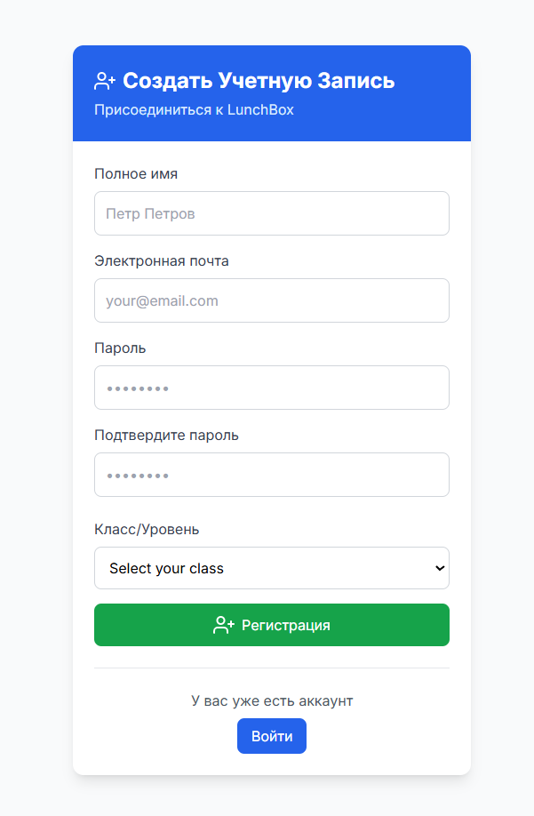
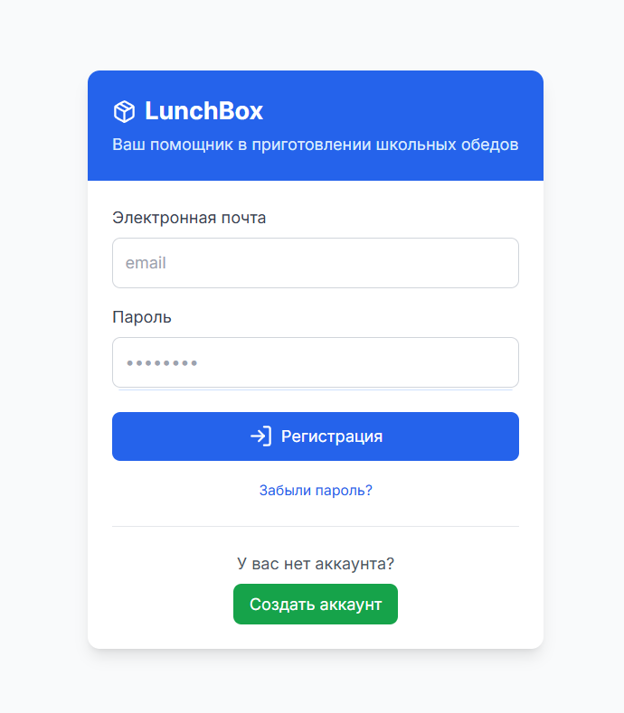
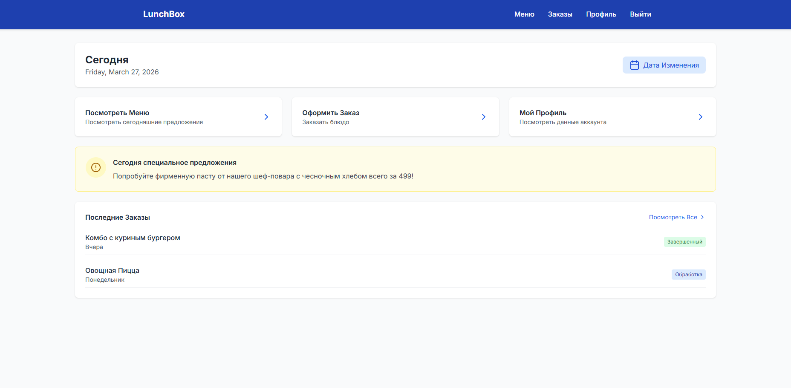
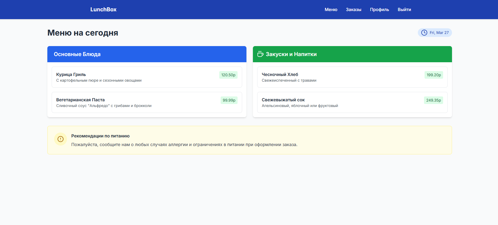
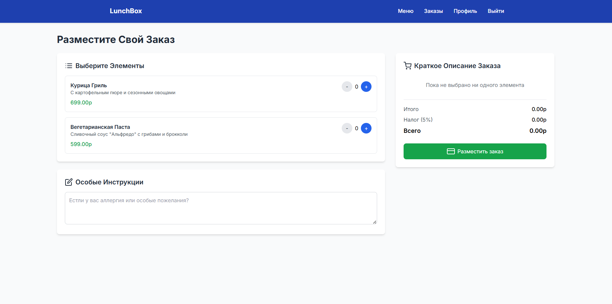
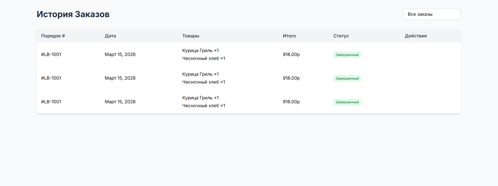
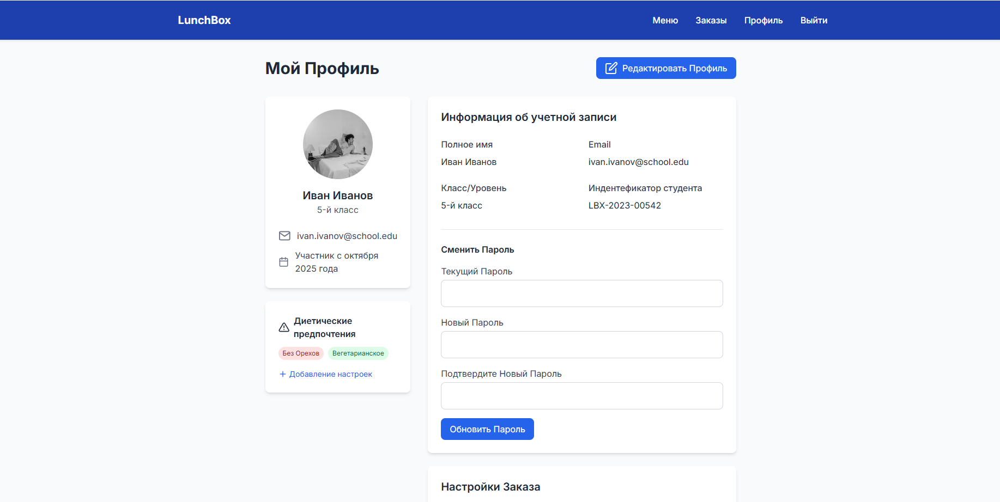

# Разработка веб-приложения для школьной столовой

Разработать информационную систему для школьной столовой, которая обеспечит автоматизацию процесса заказа питания, учёт заказов и управление меню, с целью повышения эффективности работы столовой, улучшения качества обслуживания учащихся и родителей, а также обеспечения прозрачности в учёте и распределении ресурсов.
Концептуальная модель

1. Пользователи системы:
   – Учащиеся
   – Родители
   – Администраторы (персонал столовой)
   – Менеджеры (ответственные за меню и заказы)

2. Основные функции:
   – Регистрация и аутентификация пользователей.
   – Просмотр меню и диетических предпочтений.
   – Заказ питания на определённые дни.
   – Управление текущими заказами (изменение, отмена).
   – Генерация отчетов о заказах и потреблении.
   – Уведомления о статусе заказов.

3. Сущности:
   – Пользователь (с атрибутами: ID, имя, роль, контактные данные)
   – Меню (с атрибутами: ID, название блюда, цена, описание, диетические категории)
   – Заказ (с атрибутами: ID, пользователь, дата заказа, статус)
   – Диетические предпочтения (с атрибутами: ID, пользователь, тип диеты)

# Прототип пользовательского интерфейса

Главная страница

• Заголовок с названием системы.
• Кнопки для входа и регистрации.
• Информация о системе и её функциях.

Страница регистрации

• Формы для ввода имени, роли (учащийся/родитель), контактной информации и диетических предпочтений.
• Кнопка "Зарегистрироваться".

Страница входа

• Поля для ввода логина и пароля.
• Кнопка "Войти".

Страница меню

• Список доступных блюд с описаниями и ценами.
• Возможность выбора блюд для заказа.
• Кнопка "Заказать".

Страница заказов

• Список текущих заказов с возможностью их изменения или отмены.
• Информация о статусе каждого заказа.

# Выбор технологий:
   Frontend: HTML, CSS, JavaScript (возможно использование фреймворков, таких как React или Vue.js).

# Скриншоты

